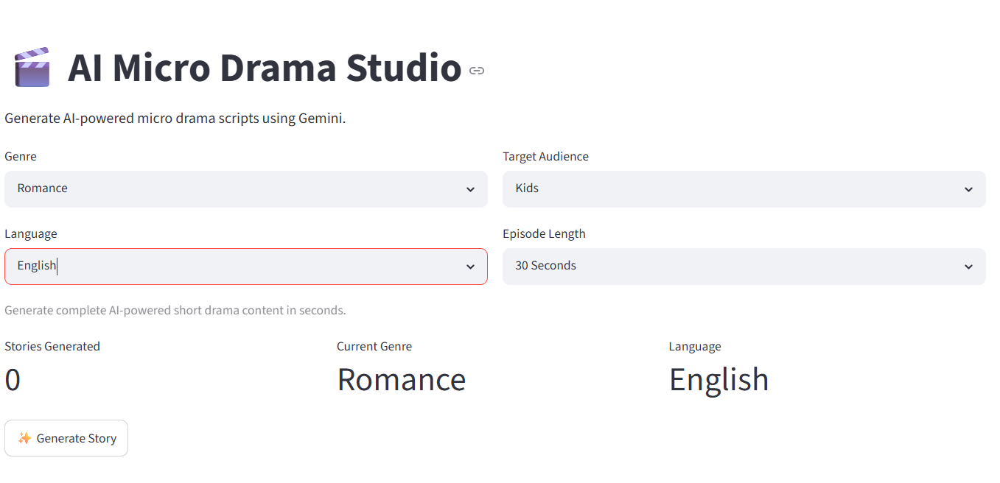

# 🎬 AI Micro Drama Studio

An AI-powered content generation application built using **Python**, **Streamlit**, and **Google Gemini API**. The application generates complete micro-drama content including story, character profiles, thumbnail prompts, voiceover scripts, Instagram captions, and hashtags.

---

## ✨ Features

- 🎭 AI-powered micro drama generation
- 👥 Character profile generation
- 🎨 Cinematic thumbnail prompt generation
- 🎙️ Voiceover script generation
- 📱 Instagram caption generation
- 🏷️ Trending hashtag generation
- 📚 Story history sidebar
- 📥 Download generated story as Markdown
- ⏳ Loading spinner and success notifications
- 📊 Dashboard metrics
- 🧩 Modular project architecture

---

## 🛠️ Tech Stack

- Python
- Streamlit
- Google Gemini API
- python-dotenv
- Git & GitHub

---

## 📂 Project Structure

```
AI-MicroDrama-Studio/
│
├── app.py
├── prompts.py
├── gemini_service.py
├── parser.py
├── requirements.txt
├── README.md
├── .env.example
└── screenshots/
```

---

## 🚀 Installation

### 1. Clone the repository

```bash
git clone https://github.com/sakshikawdker86/ai-micro-drama-studio.git
```

### 2. Navigate to the project

```bash
cd ai-micro-drama-studio
```

### 3. Create a virtual environment

```bash
python -m venv venv
```

Activate it:

**Windows**

```bash
venv\Scripts\activate
```

### 4. Install dependencies

```bash
pip install -r requirements.txt
```

### 5. Create a `.env` file

```env
GEMINI_API_KEY=YOUR_API_KEY
```

### 6. Run the application

```bash
streamlit run app.py
```

---

## 🎯 How It Works

1. Select Genre
2. Select Language
3. Select Target Audience
4. Select Duration
5. Click **Generate Story**
6. Gemini AI generates:
   - Story
   - Characters
   - Thumbnail Prompt
   - Voiceover Script
   - Instagram Caption
   - Hashtags

---

## 📸 Screenshots

Add screenshots inside the `screenshots/` folder.

Example:

```
screenshots/
├── home.png
├── generated-story.png
├── sidebar.png
├── dashboard.png
```

---

### Home



### Story

### Home


## 🏗️ Architecture

```
User
   │
   ▼
Streamlit UI
   │
   ▼
Prompt Generator
   │
   ▼
Google Gemini API
   │
   ▼
Response Parser
   │
   ▼
Structured UI
```

---

## 📈 Future Improvements

- Multi-language support
- Story export as PDF
- AI image generation integration
- Voice generation integration
- User authentication
- Story history database
- Cloud deployment

---

## 💡 Skills Demonstrated

- Prompt Engineering
- Generative AI
- Google Gemini API
- Python Development
- Streamlit
- Modular Application Design
- Session State Management
- Environment Variable Management
- Git & GitHub Workflow
- API Integration

---

## 👩‍💻 Author

**Sakshi Kawdker**

GitHub: https://github.com/sakshikawdker86/ai-micro-drama-studio

---

⭐ If you found this project useful, consider giving it a star!
